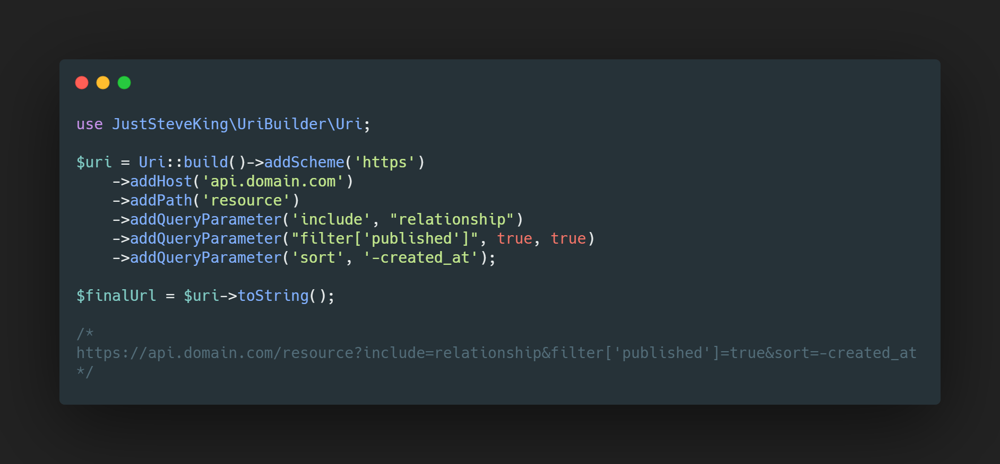

<p align="center">



</p>

# URI Builder
<!-- BADGES_START -->
[![Latest Version][badge-release]][packagist]
[![PHP Version][badge-php]][php]

[](https://scrutinizer-ci.com/g/JustSteveKing/uri-builder/?branch=main)
[![Total Downloads][badge-downloads]][downloads]

[badge-release]: https://img.shields.io/packagist/v/juststeveking/uri-builder.svg?style=flat-square&label=release
[badge-php]: https://img.shields.io/packagist/php-v/juststeveking/uri-builder.svg?style=flat-square
[badge-downloads]: https://img.shields.io/packagist/dt/juststeveking/uri-builder.svg?style=flat-square&colorB=mediumvioletred

[packagist]: https://packagist.org/packages/juststeveking/uri-builder
[php]: https://php.net
[downloads]: https://packagist.org/packages/juststeveking/uri-builder
<!-- BADGES_END -->

A simple URI builder in PHP that is slightly opinionated

## Purpose

The purpose of this package is to provide a fluent interface to build JSON:API compliant URI strings.


## Usage

Using the built in `parse_url` in PHP will produce the following output:

```php
[
    "scheme" => "https",
    "host" => "www.domain.com",
    "path" => "/api/v1/resource"
    "query" => "include=test,another&sort=-name",
]
```

This is fine for basic usage. To use this very opinionated package:

### Building Pragmatically

```php
$url = Uri::build()
           ->addScheme('https')
           ->addHost('www.domain.com')
           ->addPath('api/v1/resource')
           ->addQuery('include=test,another&sort=-name')
           ->addFragment('static-link-to-element');
```

### Creating from a String

```php
$url = Uri::fromString('https://www.domain.com/api/v1/resource?include=test,another&sort=-name')
```

### Converting back to a String

```php
$url = Uri::build()
           ->addScheme('https')
           ->addHost('www.domain.com')
           ->addPath('api/v1/resource')
           ->addQuery('include=test,another&sort=-name');

$string = $url->toString();

// optionally
echo (string) $url;
```

The `toString` method has an optional parameter which will allow you to urlencode the query parameters before returning the URI.

```php
$url = Uri::build()
           ->addScheme('https')
           ->addHost('www.domain.com')
           ->addPath('api/v1/resource')
           ->addQuery('include=test,another&sort=-name');

$string = $url->toString(true)
```

### Adding Query Parameters after creation

Creating query parameters after creation is pretty simple. You can pass through anything that isn't:

- An Object
- An Array

It has a helper option on the end of the function which will convert booleans to strings.

```php
public function addQueryParam(string $key, $value, bool $covertBoolToString = false)
```

The following is how you use it:

```php
$url = Uri::fromString('https://www.domain.com/api/v1/resource');
$url->addQueryParam('include', 'test,another,options')
    ->addQueryParam('published', true, true);
```
The output will be: `https://www.domain.com/api/v1/resource?include=test,another,options&published=true`
